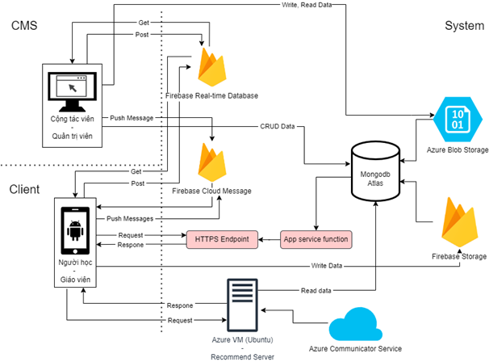

## Graduation Thesis - University of Information Technology
<table style="width: 621px;">
<tbody>
<tr>
<td style="width: 283.263px;">Members</td>
<td style="width: 344.737px;">Instructor</td>
</tr>
<tr>
<td style="width: 283.263px;">Nguyễn Văn Vượng <a href="https://github.com/Vuoncog" target="_blank">@vuoncog</a></td>
<td style="width: 344.737px;">PhD Phan Xu&acirc;n Thiện</td>
</tr>
<tr>
<td style="width: 283.263px;">Trần Bảo Ngọc <a href="https://github.com/negativex" target="_blank">@negativex</a></td>
<td style="width: 344.737px;">&nbsp;</td>
</tr>
</tbody>
</table>

### Topics
- 
<strong>Ecodemy</strong> - <em>Online and Offline Course Marketplace Application</em>

### Tech stack 
<ul>
<li><strong>Kotlin</strong>: Programming language for Android</li>
<li><strong>Jetpack Compose</strong>: UI Framework for Android</li>
<li><strong>MongoDB Atlas</strong>: Data storage</li>
<li><strong>Firebase</strong>: Image storage, Messaging, Push-notification</li>
<li><strong>Azure</strong>: Email, Image storage</li>
</ul>

### Architecture system
<ul style="list-style-type: none;">
<li><strong>CMS (Counselor, Admin)</strong>: Manage courses.</li>
<li><strong>Android (User, Teacher)</strong>: Manage resources of courses for teacher. Learning and payment for user.</li>
</ul>

### UI/UX Design
- Behance: <a href="https://www.behance.net/gallery/209412539/Thesis-Ecodemy" target="_blank">[Thesis] Ecodemy</a>

### Demo
- Drive: <a href="https://drive.google.com/drive/u/0/folders/1w9U7jVmcyRGiVm6D75KQbTGpEeMgvVXW" target="_blank">Android and CMS</a>

